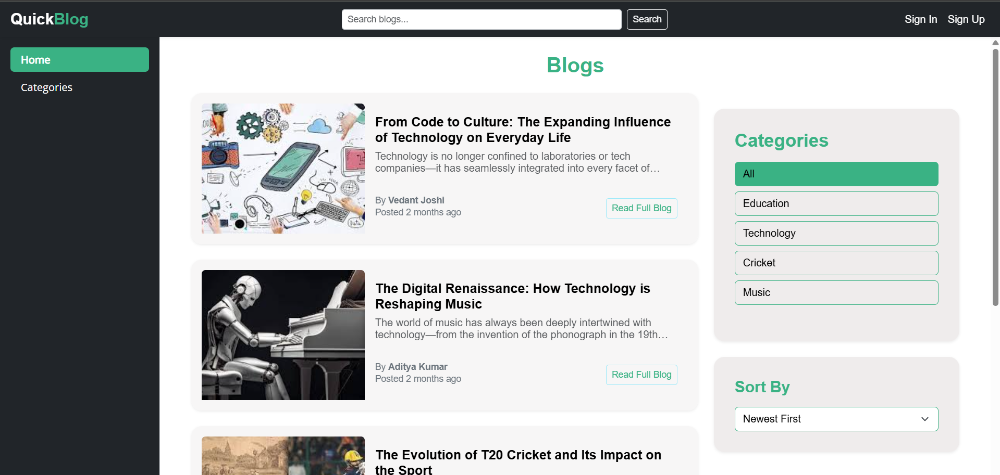
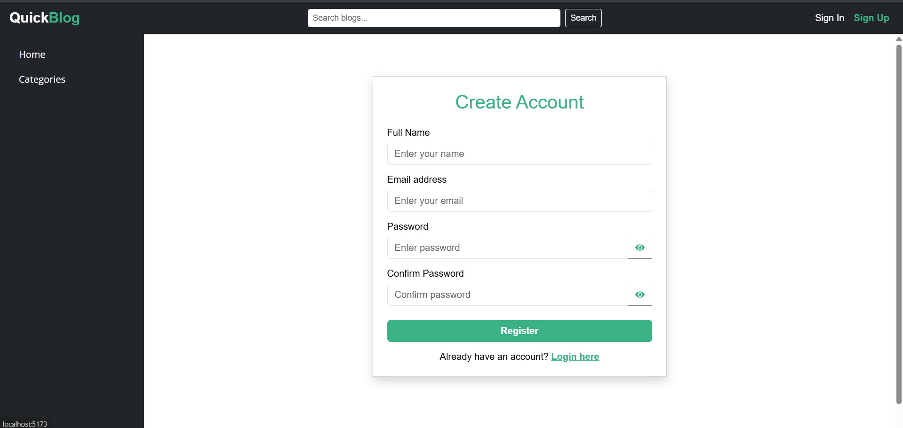
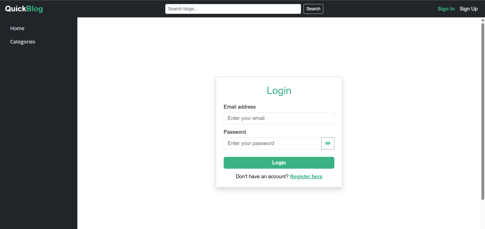
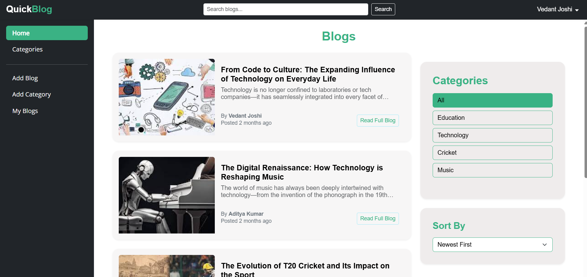

# 📝 Quick Blog

Quick Blog is a **full-stack blogging application** built using **React**, **Node.js**, **Express**, and **MySQL**. It allows users to register, log in securely with **JWT authentication**, and perform CRUD operations on blog posts. The app is fully **responsive**, styled with **Bootstrap**, and includes beautiful user feedback using **React-Toastify**.

---

## 📸 Screenshots

### 🔹 Home Page

### 🔹 category Blog

### 🔹 Create Blog

### 🔹 Create category

### 🔹 register page

### 🔹 login page

### 🔹 Home page after user login

---

## 🚀 Features

- 👤 User registration & login with **JWT**
- 🔐 Secure authentication and protected routes
- 📝 Full CRUD for blog posts
- ✅ Real-time toast notifications for user feedback
- 📱 Responsive UI with **Bootstrap**
- 🌈 Clean and minimalistic design
- 🧠 Built with modular and reusable components

---

## 🛠️ Tech Stack

**Frontend:**
- React.js
- React Router DOM
- Axios
- Bootstrap
- React Toastify

**Backend:**
- Node.js
- Express.js
- MySQL
- JWT (jsonwebtoken)
- bcrypt (for password hashing)

**Other Tools:**
- Visual Studio Code
- Git & GitHub

---

## 📂 Project Structure

\`\`\`
quick-blog/
├── backend/
│   ├── controllers/
│   ├── middleware/
│   ├── models/
│   ├── routes/
│   └── server.js
│
├── frontend/
│   ├── public/
│   └── src/
│       ├── components/
│       ├── pages/
│       ├── App.js
│       └── index.js
│
├── screenshots/
│   ├── home.png
│   ├── addblog.png
│   └── details.png
│   |── home2.png
│   ├── addcategory.png
│   └── categories.png
│   |── login.png
│   ├── register.png
│   └── categories.png
\`\`\`

---

## ⚙️ Getting Started Locally

Follow these steps to run the project on your local machine:

### 📌 Prerequisites

- Node.js & npm
- MySQL
- Git

### 🔧 Backend Setup

\`\`\`bash
cd backend
npm install
\`\`\`

#### 🔑 Create a `.env` file inside `backend` folder:

\`\`\`env
DB_HOST=localhost
DB_USER=root
DB_PASSWORD=your_mysql_password
DB_NAME=quick_blog
JWT_SECRET=your_jwt_secret_key
\`\`\`

#### 🚀 Run the server:

\`\`\`bash
node server.js
\`\`\`

### 💻 Frontend Setup

\`\`\`bash
cd frontend
npm install
npm start
\`\`\`

---

## 🔐 JWT Authentication Flow

- User signs up or logs in.
- Server returns a signed JWT token.
- Token is saved in localStorage.
- All protected requests send this token in the `Authorization` header.
- Middleware on backend verifies token before granting access.

---

## 🧪 Demo Credentials (Optional)

You can use these for testing (if you added seed users):

\`\`\`
Email: testuser@example.com
Password: 123456
\`\`\`

---

## 👨‍💻 Author

**Vedant Joshi**  
📍 Aurangabad, Maharashtra  
💼 Java Full Stack Developer  
🔗 [LinkedIn](https://www.linkedin.com/in/vedant-joshi-12b9b5205)

---

## ⭐ Show Your Support

If you found this project helpful or interesting, don’t forget to:

- ⭐ Star the repo
- 🖖 Follow me on GitHub
- 💬 Share feedback or suggestions

---

## 🔗 Related Links

- GitHub Repo: [https://github.com/Vedantjoshi123/Quick-Blog](https://github.com/Vedantjoshi123/Quick-Blog)

---
